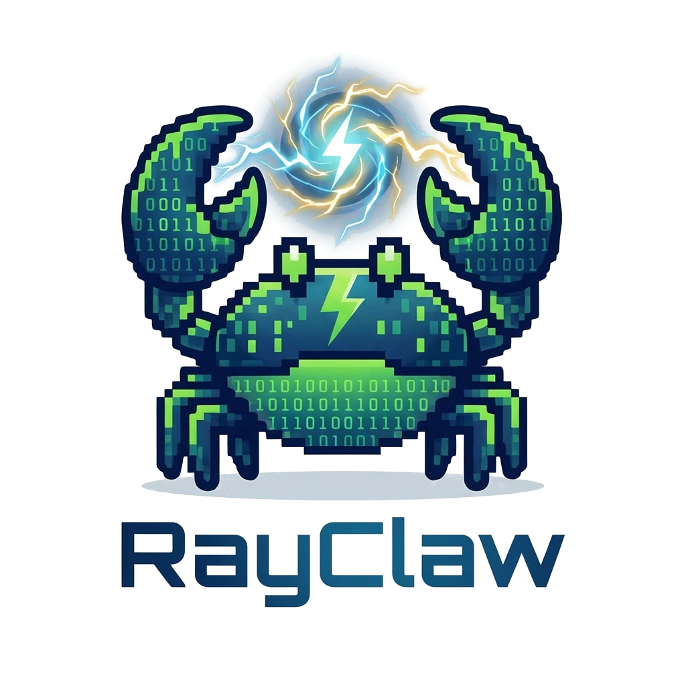
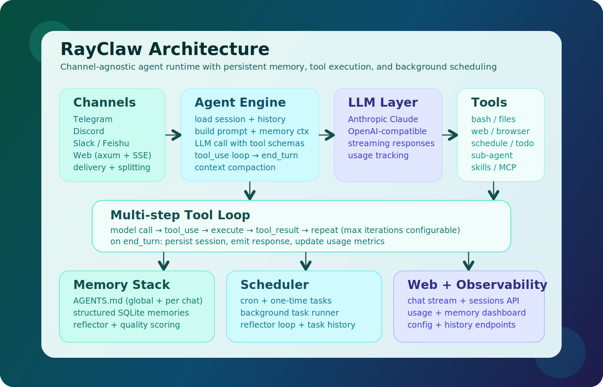
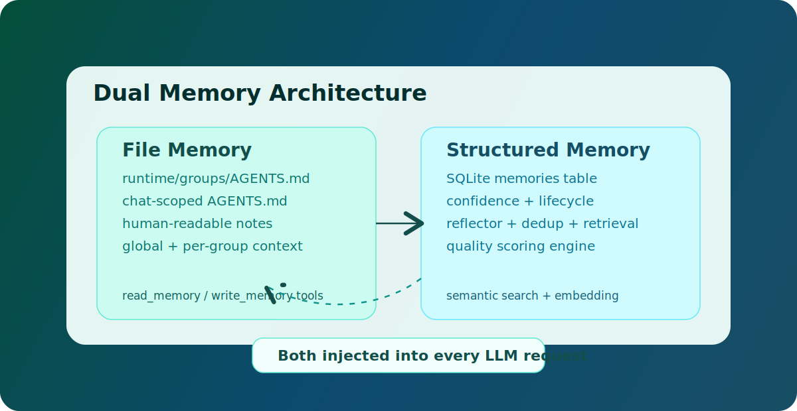
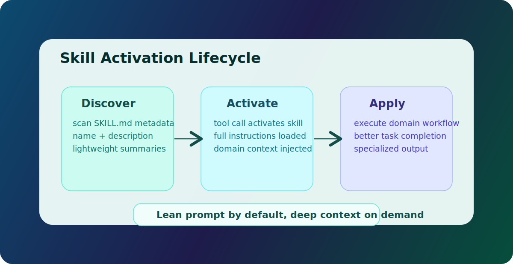
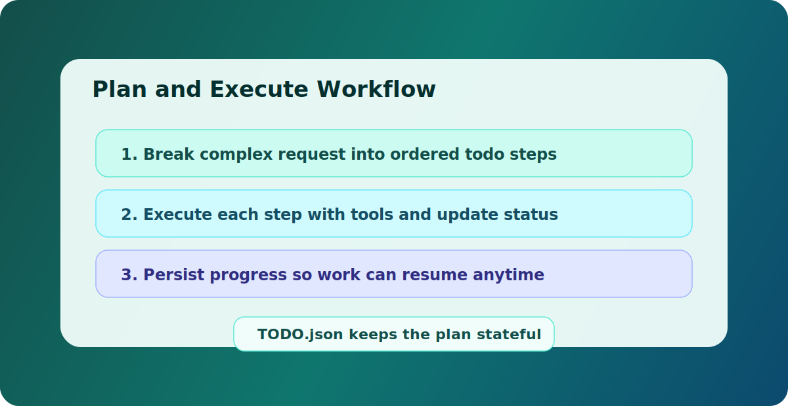
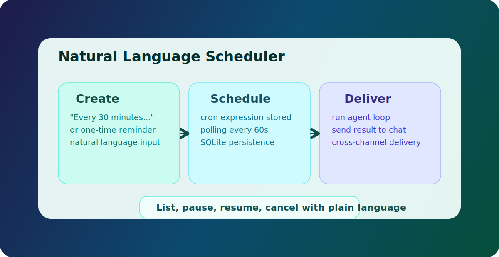

# RayClaw


[English](README.md) | [中文](README_CN.md)

[](https://crates.io/crates/rayclaw)
[](https://rayclaw.ai)
[](https://discord.gg/pPXpgN5J)
[](LICENSE)


<p align="center">
  
</p>


> **Note:** This project is under active development. Features may change, and contributions are welcome!


RayClaw is a multi-channel agentic AI runtime written in Rust. It connects to Telegram, Discord, Slack, Feishu/Lark, and a built-in Web UI through a unified agent engine. Every conversation flows through the same tool-calling loop — shell commands, file operations, web search, background scheduling, and persistent memory — regardless of which channel it arrives on. RayClaw works with multiple LLM providers (Anthropic + any OpenAI-compatible API) and is designed for extensibility: adding a new channel adapter requires no changes to the core agent engine.


<!-- TODO: Add RayClaw screenshots -->

## Table of contents

- [How it works](#how-it-works)
- [Install](#install)
- [Use as Rust crate](#use-as-rust-crate)
- [Features](#features)
- [Tools](#tools)
- [Memory](#memory)
- [Skills](#skills)
- [MCP](#mcp)
- [ACP (Agent Client Protocol)](#acp-agent-client-protocol)
- [Plan & Execute](#plan--execute)
- [Scheduling](#scheduling)
- [Local Web UI (cross-channel history)](#local-web-ui-cross-channel-history)
- [Release](#release)
- [Setup](#setup)
- [Configuration](#configuration)
- [Platform behavior](#platform-behavior)
- [Multi-chat permission model](#multi-chat-permission-model)
- [Usage examples](#usage-examples)
- [Architecture](#architecture)
- [Adding a New Platform Adapter](#adding-a-new-platform-adapter)
- [Documentation](#documentation)

## Install

### One-line installer (recommended)

```sh
curl -fsSL https://rayclaw.ai/install.sh | bash
```

### Preflight diagnostics

Run cross-platform diagnostics before first start (or when troubleshooting):

```sh
rayclaw doctor
```

Machine-readable output for support tickets:

```sh
rayclaw doctor --json
```

Checks include PATH, shell runtime, Node/npm, `agent-browser`, and MCP command dependencies from `rayclaw.data/mcp.json`.

### Uninstall (script)

```sh
curl -fsSL https://rayclaw.ai/uninstall.sh | bash
```

### From source

```sh
git clone https://github.com/rayclaw/rayclaw.git
cd rayclaw
cargo build --release --features all
cp target/release/rayclaw /usr/local/bin/
```

> **Note:** The `web` feature (built-in Web UI) is not included in default features. When building the binary locally, use `--features all` to enable all channels and Web UI. Without it, the Web UI will not be available.

Optional semantic-memory build (sqlite-vec disabled by default):

```sh
cargo build --release --features all,sqlite-vec
```

First-time sqlite-vec quickstart (3 commands):

```sh
cargo run --features sqlite-vec -- setup
cargo run --features sqlite-vec -- start
sqlite3 rayclaw.data/runtime/rayclaw.db "SELECT id, chat_id, chat_channel, external_chat_id, category, embedding_model FROM memories ORDER BY id DESC LIMIT 20;"
```

In `setup`, set:
- `embedding_provider` = `openai` or `ollama`
- provider credentials/base URL/model as needed

## Use as Rust crate

RayClaw is available on [crates.io](https://crates.io/crates/rayclaw) and can be integrated into your own Rust application as a library.

```sh
cargo add rayclaw
```

**Feature flags:**

| Feature | Default | Dependencies | Description |
|---------|---------|-------------|-------------|
| `telegram` | Yes | teloxide | Telegram channel adapter |
| `discord` | Yes | serenity | Discord channel adapter |
| `slack` | Yes | -- | Slack channel adapter (Socket Mode) |
| `feishu` | Yes | -- | Feishu/Lark channel adapter |
| `web` | **No** | axum | Built-in Web UI and HTTP API |
| `all` | No | all above | Convenience: enables all features including `web` |
| `sqlite-vec` | No | sqlite-vec | Semantic memory with vector search |

> **Important:** The `web` feature is deliberately excluded from defaults because it embeds pre-built frontend assets (`web/dist/`) at compile time via `include_dir!`. Crate consumers don't have these assets. If you need the Web UI, build from source with `--features all`.

**Minimal SDK usage (no channels, no web):**

```toml
[dependencies]
rayclaw = { version = "0.1", default-features = false }
```

```rust
use rayclaw::sdk::RayClawAgent;
use rayclaw::config::Config;

#[tokio::main]
async fn main() -> anyhow::Result<()> {
    let config = Config::load()?;
    let agent = RayClawAgent::new(config).await?;

    let reply = agent.process_message(1, "Hello!").await?;
    println!("{reply}");
    Ok(())
}
```

**With specific channels:**

```toml
[dependencies]
rayclaw = { version = "0.1", features = ["telegram", "discord"] }
```

**Local binary build (all features + Web UI):**

```sh
cargo build --release --features all
```

## How it works

Every message triggers an **agentic loop**: the model can call tools, inspect the results, call more tools, and reason through multi-step tasks before responding. Up to 100 iterations per request by default.

<p align="center">
  
</p>

## Features

- **Agentic tool use** -- bash commands, file read/write/edit, glob search, regex grep, persistent memory
- **Session resume** -- full conversation state (including tool interactions) persisted between messages; the agent keeps tool-call state across invocations
- **Context compaction** -- when sessions grow too large, older messages are automatically summarized to stay within context limits
- **Sub-agent** -- delegate self-contained sub-tasks to a parallel agent with restricted tools
- **Agent skills** -- extensible skill system ([Anthropic Skills](https://github.com/anthropics/skills) compatible); skills are auto-discovered from `rayclaw.data/skills/` and activated on demand
- **Plan & execute** -- todo list tools for breaking down complex tasks, tracking progress step by step
- **Platform-extensible architecture** -- shared agent loop + tool system + storage, with platform adapters for channel-specific ingress/egress
- **Web search** -- search the web via DuckDuckGo and fetch/parse web pages
- **Scheduled tasks** -- cron-based recurring tasks and one-time scheduled tasks, managed through natural language
- **Mid-conversation messaging** -- the agent can send intermediate messages before its final response
- **Mention catch-up (Telegram groups)** -- when mentioned in a Telegram group, the bot reads all messages since its last reply (not just the last N)
- **Continuous typing indicator** -- typing indicator stays active for the full duration of processing
- **Persistent memory** -- AGENTS.md files at global and per-chat scopes, loaded into every request
- **Message splitting** -- long responses are automatically split at newline boundaries to fit channel limits (Telegram 4096 / Discord 2000 / Slack 4000 / Feishu 4000)

## Tools

| Tool | Description |
|------|-------------|
| `bash` | Execute shell commands with configurable timeout |
| `read_file` | Read files with line numbers, optional offset/limit |
| `write_file` | Create or overwrite files (auto-creates directories) |
| `edit_file` | Find-and-replace editing with uniqueness validation |
| `glob` | Find files by pattern (`**/*.rs`, `src/**/*.ts`) |
| `grep` | Regex search across file contents |
| `read_memory` | Read persistent AGENTS.md memory (global or per-chat) |
| `write_memory` | Write persistent AGENTS.md memory |
| `web_search` | Search the web via DuckDuckGo (returns titles, URLs, snippets) |
| `web_fetch` | Fetch a URL and return plain text (HTML stripped, max 20KB) |
| `send_message` | Send mid-conversation messages; supports attachments for Telegram/Discord via `attachment_path` + optional `caption` |
| `schedule_task` | Schedule a recurring (cron) or one-time task |
| `list_scheduled_tasks` | List all active/paused tasks for a chat |
| `pause_scheduled_task` | Pause a scheduled task |
| `resume_scheduled_task` | Resume a paused task |
| `cancel_scheduled_task` | Cancel a task permanently |
| `get_task_history` | View execution history for a scheduled task |
| `export_chat` | Export chat history to markdown |
| `sub_agent` | Delegate a sub-task to a parallel agent with restricted tools |
| `activate_skill` | Activate an agent skill to load specialized instructions |
| `sync_skills` | Sync a skill from external registry (e.g. vercel-labs/skills) and normalize local frontmatter |
| `todo_read` | Read the current task/plan list for a chat |
| `todo_write` | Create or update the task/plan list for a chat |
| `acp_new_session` | Spawn an external Coding Agent (e.g. Claude Code) as a subprocess via ACP |
| `acp_prompt` | Send a coding task to an active ACP agent session and wait for completion |
| `acp_end_session` | End an ACP agent session and terminate the agent subprocess |
| `acp_list_sessions` | List all active ACP agent sessions with their status |

Generated reference (source-of-truth, anti-drift):
- `docs/generated/tools.md`
- `docs/generated/config-defaults.md`
- `docs/generated/provider-matrix.md`

Regenerate with:
```sh
node scripts/generate_docs_artifacts.mjs
```

## Memory

<p align="center">
  
</p>

RayClaw maintains persistent memory via `AGENTS.md` files:

```
rayclaw.data/runtime/groups/
    AGENTS.md                 # Global memory (shared across all chats)
    {chat_id}/
        AGENTS.md             # Per-chat memory
```

Memory is loaded into the system prompt on every request. The model can read and update memory through tools -- tell it to "remember that I prefer Python" and it will persist across sessions.

RayClaw also keeps structured memory rows in SQLite (`memories` table):
- `write_memory` persists to file memory and structured memory
- Background reflector extracts durable facts incrementally and deduplicates
- Explicit "remember ..." commands use a deterministic fast path (direct structured-memory upsert)
- Low-quality/noisy memories are filtered by quality gates before insertion
- Memory lifecycle is managed with confidence + soft-archive fields (instead of hard delete)

When built with `--features sqlite-vec` and embedding config is set, structured-memory retrieval and dedup use semantic KNN. Otherwise, it falls back to keyword relevance + Jaccard dedup.

`/usage` now includes a **Memory Observability** section (and Web UI panel) showing:
- memory pool health (active/archived/low-confidence)
- reflector throughput (insert/update/skip in 24h)
- injection coverage (selected vs candidate memories in 24h)

### Chat Identity Mapping

RayClaw now stores a channel-scoped identity for chats:

- `internal chat_id`: SQLite primary key used by sessions/messages/tasks
- `channel + external_chat_id`: source chat identity from Telegram/Discord/Slack/Feishu/Web

This avoids collisions when different channels can have the same numeric id. Legacy rows are migrated automatically on startup.

Useful SQL for debugging:

```sql
SELECT chat_id, channel, external_chat_id, chat_type, chat_title
FROM chats
ORDER BY last_message_time DESC
LIMIT 50;

SELECT id, chat_id, chat_channel, external_chat_id, category, content, embedding_model
FROM memories
ORDER BY id DESC
LIMIT 50;
```

## Skills

<p align="center">
  
</p>

RayClaw supports the [Anthropic Agent Skills](https://github.com/anthropics/skills) standard. Skills are modular packages that give the bot specialized capabilities for specific tasks.

```
rayclaw.data/skills/
    pdf/
        SKILL.md              # Required: name, description + instructions
    docx/
        SKILL.md
```

**How it works:**
1. Skill metadata (name + description) is always included in the system prompt (~100 tokens per skill)
2. When the model determines a skill is relevant, it calls `activate_skill` to load the full instructions
3. The model follows the skill instructions to complete the task

**Built-in skills:** pdf, docx, xlsx, pptx, skill-creator, apple-notes, apple-reminders, apple-calendar, weather, find-skills

**New macOS skills (examples):**
- `apple-notes` -- manage Apple Notes via `memo`
- `apple-reminders` -- manage Apple Reminders via `remindctl`
- `apple-calendar` -- query/create Calendar events via `icalBuddy` + `osascript`
- `weather` -- quick weather lookup via `wttr.in`

**Adding a skill:** Create a subdirectory under `rayclaw.data/skills/` with a `SKILL.md` file containing YAML frontmatter and markdown instructions.

Supported frontmatter fields:
- `name`, `description`
- `platforms` (optional): e.g. `[darwin, linux, windows]`
- `deps` (optional): required commands in `PATH`
- `compatibility.os` / `compatibility.deps` (also supported)

Unavailable skills are filtered automatically by platform/dependencies, so unsupported skills do not appear in `/skills`.

**Commands:**
- `/skills` -- list all available skills
- `/usage` -- show token usage summary (current chat + global totals)

## MCP

RayClaw supports MCP servers configured in `rayclaw.data/mcp.json` with protocol negotiation and configurable transport.

- Default protocol version: `2025-11-05` (overridable globally or per server)
- Supported transports: `stdio`, `streamable_http`

Recommended production start (minimal local MCP only):

```sh
cp mcp.minimal.example.json rayclaw.data/mcp.json
```

Full example (includes optional remote streamable HTTP server):

```sh
cp mcp.example.json rayclaw.data/mcp.json
```

Example:

```json
{
  "defaultProtocolVersion": "2025-11-05",
  "mcpServers": {
    "filesystem": {
      "transport": "stdio",
      "command": "npx",
      "args": ["-y", "@modelcontextprotocol/server-filesystem", "."]
    },
    "remote": {
      "transport": "streamable_http",
      "endpoint": "http://127.0.0.1:8080/mcp"
    }
  }
}
```

Migration evaluation to official Rust SDK is tracked in `docs/mcp-sdk-evaluation.md`.

Validation:

```sh
RUST_LOG=info cargo run -- start
```

Look for log lines like `MCP server '...' connected (...)`.

## ACP (Agent Client Protocol)

RayClaw can spawn and control external Coding Agents (Claude Code, OpenCode, Gemini CLI, etc.) as subprocesses via the ACP (Agent Client Protocol). This lets the bot delegate complex coding tasks to specialized agents that can autonomously read/write files, run commands, and complete multi-step work.

Configure agents in `rayclaw.data/acp.json`:

```json
{
  "defaultAutoApprove": true,
  "promptTimeoutSecs": 300,
  "acpAgents": {
    "claude": {
      "launch": "npx",
      "command": "@anthropic-ai/claude-code@latest",
      "args": ["--acp"],
      "env": { "ANTHROPIC_API_KEY": "sk-ant-..." },
      "workspace": "/path/to/projects"
    }
  }
}
```

Minimal config (uses defaults):

```sh
cp acp.minimal.example.json rayclaw.data/acp.json
```

Full example with multiple agents:

```sh
cp acp.example.json rayclaw.data/acp.json
```

**Config fields:**

| Field | Required | Default | Description |
|-------|----------|---------|-------------|
| `defaultAutoApprove` | No | `false` | Auto-approve agent tool calls by default |
| `promptTimeoutSecs` | No | `300` | Max seconds to wait for a prompt to complete |
| `acpAgents` | Yes | `{}` | Map of agent name to agent config |

**Agent config fields:**

| Field | Required | Default | Description |
|-------|----------|---------|-------------|
| `launch` | No | `npx` | Launch method: `npx`, `binary`, or `uvx` |
| `command` | Yes | -- | Package name (npx/uvx) or executable path (binary) |
| `args` | No | `[]` | Extra arguments |
| `env` | No | `{}` | Environment variables for the agent process |
| `workspace` | No | `.` | Default working directory |
| `auto_approve` | No | global default | Override auto-approve for this agent |

**ACP tools:**

| Tool | Risk | Description |
|------|------|-------------|
| `acp_new_session` | Medium | Spawn an agent and create a session |
| `acp_prompt` | High | Send a coding task and wait for completion |
| `acp_end_session` | Low | End a session and terminate the agent |
| `acp_list_sessions` | Low | List all active sessions |

**Prerequisites:** Claude Code requires Node.js (npx). Binary agents need the executable installed.

Validation:

```sh
RUST_LOG=info cargo run -- start
```

Look for log lines like `ACP config loaded: 1 agent(s) configured (claude)`.

## Plan & Execute

<p align="center">
  
</p>

For complex, multi-step tasks, the bot can create a plan and track progress:

```
You: Set up a new Rust project with CI, tests, and documentation
Bot: [creates a todo plan, then executes each step, updating progress]

1. [x] Create project structure
2. [x] Add CI configuration
3. [~] Write unit tests
4. [ ] Add documentation
```

Todo lists are stored at `rayclaw.data/runtime/groups/{chat_id}/TODO.json` and persist across sessions.

## Scheduling

<p align="center">
  
</p>

The bot supports scheduled tasks via natural language:

- **Recurring:** "Remind me to check the logs every 30 minutes" -- creates a cron task
- **One-time:** "Remind me at 5pm to call Alice" -- creates a one-shot task

Under the hood, recurring tasks use 6-field cron expressions (sec min hour dom month dow). The scheduler polls every 60 seconds for due tasks, runs the agent loop with the task prompt, and sends results to the originating chat.

Manage tasks with natural language:
```
"List my scheduled tasks"
"Pause task #3"
"Resume task #3"
"Cancel task #3"
```

## Local Web UI (cross-channel history)

When `web_enabled: true`, RayClaw serves a local Web UI (default `http://127.0.0.1:10961`).

- Session list includes chats from all channels stored in SQLite (`telegram`, `discord`, `slack`, `feishu`, `web`)
- You can review and manage history (refresh / clear context / delete)
- Non-web channels are read-only in Web UI by default (send from source channel)
- If there are no sessions yet, Web UI auto-generates a new key like `session-YYYYMMDDHHmmss`
- The first message in that session automatically persists it in SQLite

## Release

Publish installer mode (GitHub Release asset used by `install.sh`):

```sh
./deploy.sh
```

## Setup

> **New:** RayClaw now includes an interactive setup wizard (`rayclaw setup`) and will auto-launch it on first `start` when required config is missing.

### 1. Create channel bot credentials

Enable at least one channel: Telegram, Discord, Slack, Feishu/Lark, or Web UI.

Telegram (optional):
1. Open Telegram and search for [@BotFather](https://t.me/BotFather)
2. Send `/newbot`
3. Enter a display name for your bot (e.g. `My RayClaw`)
4. Enter a username (must end in `bot`, e.g. `my_rayclaw_bot`)
5. BotFather will reply with a token like `123456789:ABCdefGHIjklMNOpqrsTUVwxyz` -- save this as `telegram_bot_token`

Recommended BotFather settings (optional but useful):
- `/setdescription` -- set a short description shown in the bot's profile
- `/setcommands` -- register commands so users see them in the menu:
  ```
  reset - Clear current session
  skills - List available agent skills
  ```
- `/setprivacy` -- set to `Disable` if you want the bot to see all group messages (not just @mentions)

Discord (optional):
1. Open the [Discord Developer Portal](https://discord.com/developers/applications)
2. Create an application and add a bot
3. Copy the bot token and save it as `discord_bot_token`
4. Invite the bot to your server with `Send Messages`, `Read Message History`, and mention permissions
5. Optional: set `discord_allowed_channels` to restrict where the bot can reply

Slack (optional, Socket Mode):
1. Create an app at [api.slack.com/apps](https://api.slack.com/apps)
2. Enable Socket Mode and get an `app_token` (starts with `xapp-`)
3. Add `bot_token` scope and install to workspace to get `bot_token` (starts with `xoxb-`)
4. Subscribe to `message` and `app_mention` events
5. Configure under `channels.slack` in config

Feishu/Lark (optional):
1. Create an app at the [Feishu Open Platform](https://open.feishu.cn/app) (or [Lark Developer](https://open.larksuite.com/app) for international)
2. Get `app_id` and `app_secret` from app credentials
3. Enable `im:message` and `im:message.receive_v1` event subscription
4. Choose connection mode: WebSocket (default, no public URL needed) or Webhook
5. Configure under `channels.feishu` in config; set `domain: "lark"` for international

### 2. Get an LLM API key

Choose a provider and create an API key:
- Anthropic: [console.anthropic.com](https://console.anthropic.com/)
- OpenAI: [platform.openai.com](https://platform.openai.com/)
- Or any OpenAI-compatible provider (OpenRouter, DeepSeek, etc.)
- For `openai-codex`, you can use OAuth (`codex login`) or an API key (for OpenAI-compatible proxy endpoints).

### 3. Configure (recommended: interactive Q&A)

```sh
rayclaw setup
```

<!-- Setup wizard screenshot placeholder -->
<!-- Replace with real screenshot later -->
<!-- TODO: Add RayClaw setup wizard screenshot -->

The `config` flow provides:
- Question-by-question prompts with defaults (`Enter` to confirm quickly)
- Provider selection + model selection (numbered choices with custom override)
- Better Ollama UX: local model auto-detection + sensible local defaults
- Safe `rayclaw.config.yaml` save with automatic backup
- Auto-created directories for `data_dir` and `working_dir`

If you prefer the full-screen TUI, you can still run:

```sh
rayclaw setup
```

Provider presets available in the wizard:
- `openai`
- `openai-codex` (ChatGPT/Codex subscription OAuth; run `codex login`)
- `openrouter`
- `anthropic`
- `ollama`
- `google`
- `alibaba`
- `deepseek`
- `moonshot`
- `mistral`
- `azure`
- `bedrock`
- `zhipu`
- `minimax`
- `cohere`
- `tencent`
- `xai`
- `huggingface`
- `together`
- `custom` (manual provider/model/base URL)

For Ollama, `llm_base_url` defaults to `http://127.0.0.1:11434/v1`, `api_key` is optional, and the interactive setup wizard can auto-detect locally installed models.

For `openai-codex`, you can run `codex login` first and RayClaw will read OAuth from `~/.codex/auth.json` (or `$CODEX_HOME/auth.json`). You can also provide `api_key` when using an OpenAI-compatible proxy endpoint. The default base URL is `https://chatgpt.com/backend-api`.

You can still configure manually with `rayclaw.config.yaml`:

```
telegram_bot_token: "123456:ABC-DEF1234..."
bot_username: "my_bot"
llm_provider: "anthropic"
api_key: "sk-ant-..."
model: "claude-sonnet-4-20250514"
# optional
# llm_base_url: "https://..."
data_dir: "./rayclaw.data"
working_dir: "./tmp"
working_dir_isolation: "chat" # optional; defaults to "chat" if omitted
max_document_size_mb: 100
memory_token_budget: 1500
timezone: "UTC"
# optional semantic memory runtime config (requires --features sqlite-vec build)
# embedding_provider: "openai"   # openai | ollama
# embedding_api_key: "sk-..."
# embedding_base_url: "https://api.openai.com/v1"
# embedding_model: "text-embedding-3-small"
# embedding_dim: 1536
```

### 4. Run

```sh
rayclaw start
```

### 5. Run as persistent gateway service (optional)

```sh
rayclaw gateway install
rayclaw gateway status
```

Manage service lifecycle:

```sh
rayclaw gateway start
rayclaw gateway stop
rayclaw gateway logs 200
rayclaw gateway uninstall
```

Notes:
- macOS uses `launchd` user agents.
- Linux uses `systemd --user`.
- Runtime logs are written to `rayclaw.data/runtime/logs/`.
- Log file format is hourly: `rayclaw-YYYY-MM-DD-HH.log`.
- Logs older than 30 days are deleted automatically.

## Configuration

All configuration is via `rayclaw.config.yaml`:

| Key | Required | Default | Description |
|----------|----------|---------|-------------|
| `telegram_bot_token` | No* | -- | Telegram bot token from BotFather |
| `discord_bot_token` | No* | -- | Discord bot token from Discord Developer Portal |
| `discord_allowed_channels` | No | `[]` | Discord channel ID allowlist; empty means no channel restriction |
| `api_key` | Yes* | -- | LLM API key (`ollama` can leave this empty; `openai-codex` supports OAuth or `api_key`) |
| `bot_username` | No | -- | Telegram bot username (without @; needed for Telegram group mentions) |
| `llm_provider` | No | `anthropic` | Provider preset ID (or custom ID). `anthropic` uses native Anthropic API, others use OpenAI-compatible API |
| `model` | No | provider-specific | Model name |
| `model_prices` | No | `[]` | Optional per-model pricing table (USD per 1M tokens) used by `/usage` cost estimates |
| `llm_base_url` | No | provider preset default | Custom provider base URL |
| `data_dir` | No | `./rayclaw.data` | Data root (`runtime` data in `data_dir/runtime`, skills in `data_dir/skills`) |
| `working_dir` | No | `./tmp` | Default working directory for tool operations; relative paths in `bash/read_file/write_file/edit_file/glob/grep` resolve from here |
| `working_dir_isolation` | No | `chat` | Working directory isolation mode for `bash/read_file/write_file/edit_file/glob/grep`: `shared` uses `working_dir/shared`, `chat` isolates each chat under `working_dir/chat/<channel>/<chat_id>` |
| `max_tokens` | No | `8192` | Max tokens per model response |
| `max_tool_iterations` | No | `100` | Max tool-use loop iterations per message |
| `max_document_size_mb` | No | `100` | Maximum allowed size for inbound Telegram documents; larger files are rejected with a hint message |
| `memory_token_budget` | No | `1500` | Estimated token budget for injecting structured memories into prompt context |
| `max_history_messages` | No | `50` | Number of recent messages sent as context |
| `control_chat_ids` | No | `[]` | Chat IDs that can perform cross-chat actions (send_message/schedule/export/memory global/todo) |
| `max_session_messages` | No | `40` | Message count threshold that triggers context compaction |
| `compact_keep_recent` | No | `20` | Number of recent messages to keep verbatim during compaction |
| `embedding_provider` | No | unset | Runtime embedding provider (`openai` or `ollama`) for semantic memory retrieval; requires `--features sqlite-vec` build |
| `embedding_api_key` | No | unset | API key for embedding provider (optional for `ollama`) |
| `embedding_base_url` | No | provider default | Optional base URL override for embedding provider |
| `embedding_model` | No | provider default | Embedding model ID |
| `embedding_dim` | No | provider default | Embedding vector dimension for sqlite-vec index initialization |

`*` At least one channel must be enabled: `telegram_bot_token`, `discord_bot_token`, `channels.slack`, `channels.feishu`, or `web_enabled: true`.

### Supported `llm_provider` values

`openai`, `openai-codex`, `openrouter`, `anthropic`, `ollama`, `google`, `alibaba`, `deepseek`, `moonshot`, `mistral`, `azure`, `bedrock`, `zhipu`, `minimax`, `cohere`, `tencent`, `xai`, `huggingface`, `together`, `custom`.

## Platform behavior

- Telegram private chats: respond to every message.
- Telegram groups: respond only when mentioned with `@bot_username`; all group messages are still stored for context.
- Discord DMs: respond to every message.
- Discord server channels: respond on @mention; optionally constrained by `discord_allowed_channels`.
- Slack DMs: respond to every message.
- Slack channels: respond on @mention; optionally constrained by `allowed_channels`.
- Feishu/Lark DMs (p2p): respond to every message.
- Feishu/Lark groups: respond on @mention; optionally constrained by `allowed_chats`.

**Catch-up behavior (Telegram groups):** When mentioned in a group, the bot loads all messages since its last reply in that group (instead of just the last N messages). This means it catches up on everything it missed, making group interactions much more contextual.

## Multi-chat permission model

Tool calls are authorized against the current chat:

- Non-control chats can only operate on their own `chat_id`
- Control chats (`control_chat_ids`) can operate across chats
- `write_memory` with `scope: "global"` is restricted to control chats

Affected tools include `send_message`, scheduling tools, `export_chat`, `todo_*`, and chat-scoped memory operations.

## Usage examples

**Web search:**
```
You: Search the web for the latest Rust release notes
Bot: [searches DuckDuckGo, returns top results with links]
```

**Web fetch:**
```
You: Fetch https://example.com and summarize it
Bot: [fetches page, strips HTML, summarizes content]
```

**Scheduling:**
```
You: Every morning at 9am, check the weather in Tokyo and send me a summary
Bot: Task #1 scheduled. Next run: 2025-06-15T09:00:00+00:00

[Next morning at 9am, bot automatically sends weather summary]
```

**Mid-conversation messaging:**
```
You: Analyze all log files in /var/log and give me a security report
Bot: [sends "Scanning log files..." as progress update]
Bot: [sends "Found 3 suspicious entries, analyzing..." as progress update]
Bot: [sends final security report]
```

**Coding help:**
```
You: Find all TODO comments in this project and fix them
Bot: [greps for TODOs, reads files, edits them, reports what was done]
```

**Memory:**
```
You: Remember that the production database is on port 5433
Bot: Saved to chat memory.

[Three days later]
You: What port is the prod database on?
Bot: Port 5433.
```

## Architecture

```
src/
    main.rs              # Entry point, CLI
    config.rs            # Environment variable loading
    error.rs             # Error types (thiserror)
    telegram.rs          # Telegram handler, agentic tool-use loop, session resume, context compaction, typing indicator
    llm.rs               # LLM provider abstraction (Anthropic + OpenAI-compatible)
    llm_types.rs         # Canonical message/tool schema shared across LLM adapters
    db.rs                # SQLite: messages, chats, scheduled_tasks, sessions
    memory.rs            # AGENTS.md memory system
    skills.rs            # Agent skills system (discovery, activation)
    scheduler.rs         # Background task scheduler (60s polling loop)
    tools/
        mod.rs           # Tool trait + registry (27+ tools)
        bash.rs          # Shell execution
        read_file.rs     # File reading
        write_file.rs    # File writing
        edit_file.rs     # Find/replace editing
        glob.rs          # File pattern matching
        grep.rs          # Regex content search
        memory.rs        # Memory read/write tools
        web_search.rs    # DuckDuckGo web search
        web_fetch.rs     # URL fetching with HTML stripping
        send_message.rs  # Mid-conversation messaging (text + channel attachments)
        schedule.rs      # 5 scheduling tools (create/list/pause/resume/cancel)
        sub_agent.rs     # Sub-agent with restricted tool registry
        activate_skill.rs # Skill activation tool
        todo.rs          # Plan & execute todo tools
        acp.rs           # 4 ACP tools (new_session/prompt/end_session/list_sessions)
    acp.rs               # ACP manager, connection layer, session lifecycle
```

Key design decisions:
- **Session resume** persists full message history (including tool blocks) in SQLite; context compaction summarizes old messages to stay within limits
- **Provider abstraction** with native Anthropic + OpenAI-compatible endpoints
- **SQLite with WAL mode** for concurrent read/write from async context
- **Exponential backoff** on 429 rate limits (3 retries)
- **Message splitting** for long channel responses
- **`Arc<Database>`** shared across tools and scheduler for thread-safe DB access
- **Continuous typing indicator** via a spawned task that sends typing action every 4 seconds

## Adding a New Platform Adapter

RayClaw's core loop is channel-agnostic. A new platform integration should mainly be an adapter layer:

1. Implement inbound mapping from platform events into canonical chat inputs (`chat_id`, sender, chat type, content blocks).
2. Reuse the shared `process_with_agent` flow instead of creating a platform-specific agent loop.
3. Implement outbound delivery for text and attachment responses (including platform-specific length limits).
4. Define mention/reply trigger rules for group/server contexts.
5. Preserve session key stability so resume/compaction/memory continue to work across restarts.
6. Apply existing authorization and safety boundaries (`control_chat_ids`, tool constraints, path guard).
7. Add adapter-specific integration tests under `TEST.md` patterns (DM/private, group/server mention, `/reset`, limits, failures).

## Documentation

| File | Description |
|------|-------------|
| [README.md](README.md) | This file -- overview, setup, usage |
| [DEVELOP.md](DEVELOP.md) | Developer guide -- architecture, adding tools, debugging |
| [TEST.md](TEST.md) | Manual testing guide for all features |
| [CLAUDE.md](CLAUDE.md) | Project context for AI coding assistants |
| [AGENTS.md](AGENTS.md) | Agent-friendly project reference |

## Acknowledgments

RayClaw draws inspiration from these projects:

- [OpenClaw](https://github.com/openclaw/openclaw) -- Open-source AI agent framework
- [ZeroClaw](https://github.com/zeroclaw-labs/zeroclaw) -- Zero-dependency AI agent core
- [MicroClaw](https://github.com/microclaw/microclaw) -- Lightweight AI agent runtime
- [NanoBot](https://github.com/HKUDS/nanobot) -- Minimal chatbot framework

## License

MIT

## Star History

[](https://star-history.com/#rayclaw/rayclaw&Date)
